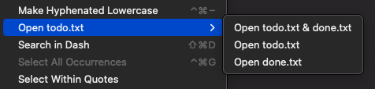

**Open todo.txt** add the ability to open the current project's `todo.txt` and/or `done.txt` in Nova, or an external app of your choice.

## Usage

To access the commands:

- Select the **Editor → Open todo.txt** menu item; or
- Open the command palette and type `open txt` to see all provided commands.

The available workspace commands are:

- **Open todo.txt & done.txt**
- **Open todo.txt**
- **Open done.txt**

### Configuration

You can select which `app` to open the `todo.txt` and/or `done.txt` files in. The default value is `/Applications/Nova.app`, so the files will open in new tabs in the current workspace.

Alternatively, you can choose an external app such as [TodoTxtMac](https://mjdescy.github.io/TodoTxtMac/) or [SwiftoDo Desktop](https://swiftodoapp.com/desktop/).

To configure global preferences, open **Extensions → Extension Library...** then select Todo's **Preferences** tab.

You can also configure preferences on a per-project basis in **Project → Project Settings...**

## Notes

If either or both of todo.txt and done.txt do not exist then you'll get an error. You will need to create these two files yourself.
